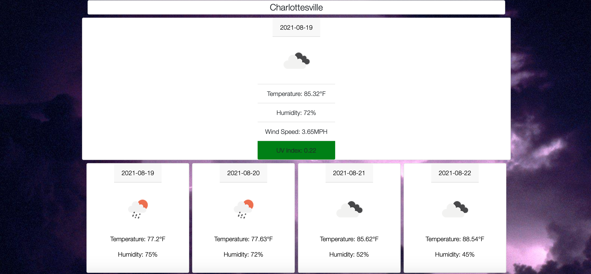

# Weather-Dash
 
A simple weather dashboard that retrieves a five day forecast by city, displaying the date, an icon describing weather conditions, temperature, and humidity. The current day also displays windspeed and a UV index that changes color according to severity. Local storage saves past searches, with on-click button functionality soon to come.

## Technologies
Javascript, CSS, Bootstrap, HTML, and the Openweather API

## Deployment

